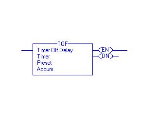
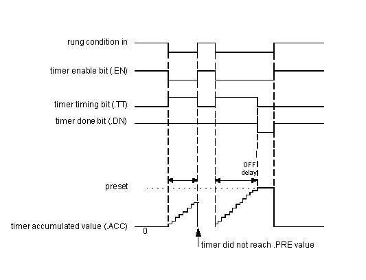
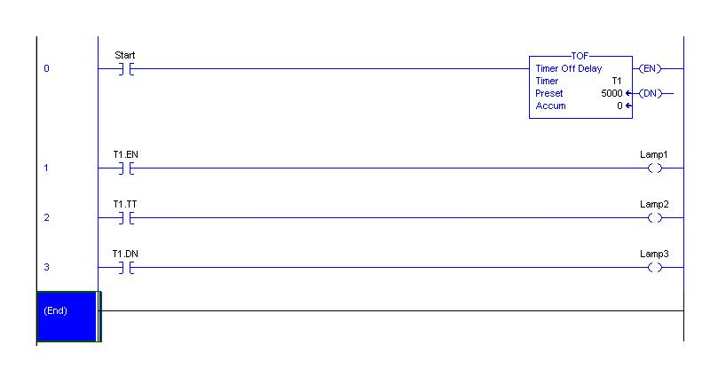

**Introduction**
The timer concept and details of on delay timers with its terminology is discussed in the previous experiment. Let us learn about Off-Delay Timer (TOF).
**OFF-Delay Timer:**
Consider an example where the contents of a storage tank are to transfer to further process. When the low level is detected by level switch the outlet valve is to be closed. To allow entire contents to drain out, some time delay is needed as the level switch is installed slightly above the tank bottom level. This can be achieved by using off delay timer.
Consider an example that, there is a Low level switch to a tank, and we have to close the drain valve of the tank after 5 second delay when low level is reached. In this case this 5 seconds delay can be given using off delay timer as we have to close the drain valve after delay.
The figure below shows a symbolic representation of the off delay timer.

The instruction mainly includes three status bits namely EN, TT, DN. Their significance is as follows: \
EN-Enable Bit: - The enable bit indicates the TOF instruction is enabled. \
TT-Timer-Timing Bit: - The timing bit indicates the timing operation is in process. \
DN- Done Bit: - The done bit changes state whenever the accumulated value reaches the preset value. \
ACC- Accumulator Bit: - The accumulated value specifies the number of milliseconds that have elapsed since the TOF instruction was enabled. \
Pre-Preset Bit: - The preset value specifies the value (1msec units) which the accumulated value must reach before the instruction clears the DN bit. \
The figure shows the timing diagram which illustrates the functioning of all the bits in sequence. \
The timing diagram illustrates the functioning of all the bits in sequence.

The following example, will illustrate the function of each bit of Off Delay Timer after downloading the ladder and taking the PLC in run mode.

For low to high transition of start bit, timer will start lamp 3 will glow, as T1.DN,bit is high. When the start bit is toggled again i.e from high to low, the delay is provided and after 5 seconds delay lamp3 will be off.

**The Function Block Diagram, Timing diagrams, and ladder diagram solutions are as per the available PLC(Rockwell Automation) in College of Engineering Pune.**

