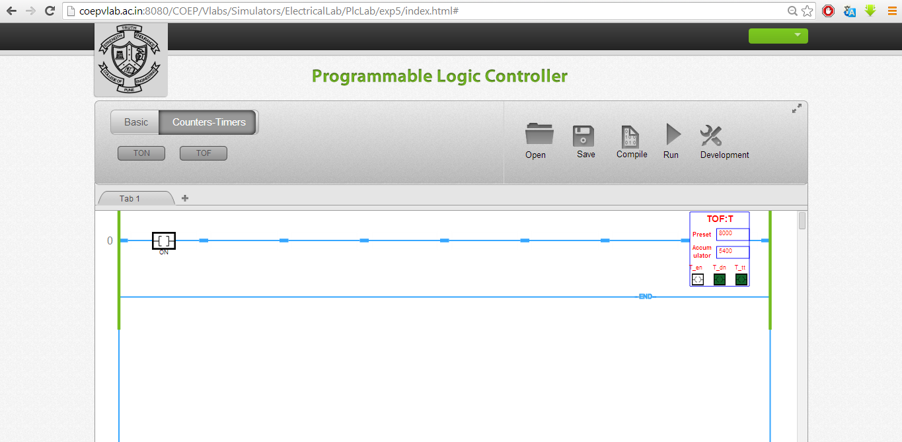

### Develop an application using Off-Delay Timer
**Implement the operation using Simulator.**
The configuration of off delay timer is same as 'on delay timer'.
A typical difference can be observed in the operation (in Run mode) .
When the q bit is energised the output DN bit goes high. The timer starts only after toggling the initialisation bit again.

Implement the operation using Simulator. To test the EN, DN, and TT bits; Configure the timer. The same tag name is to be used in the new rung to test the status or to verify the output status. You can also test the cascading of the timer using these bits.